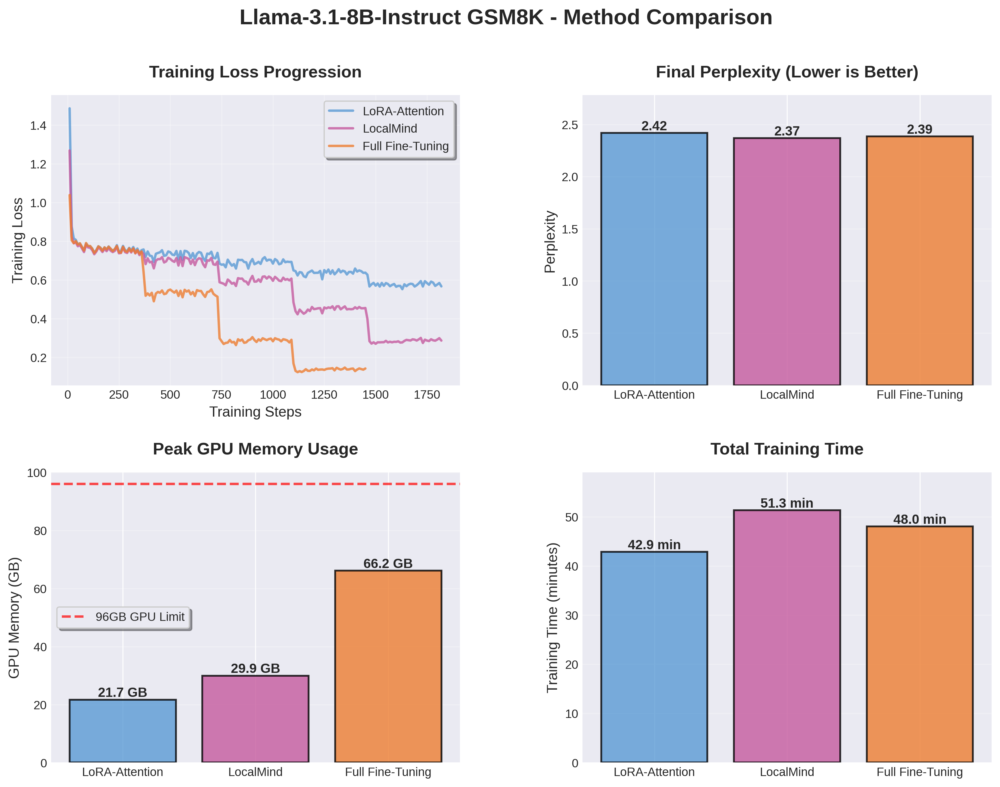
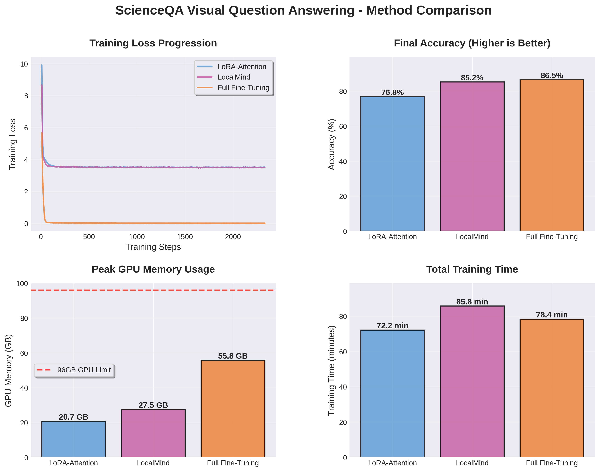
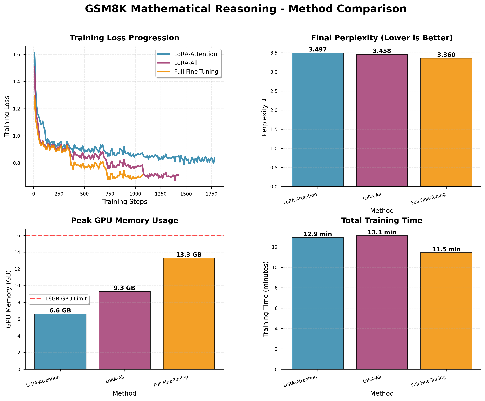
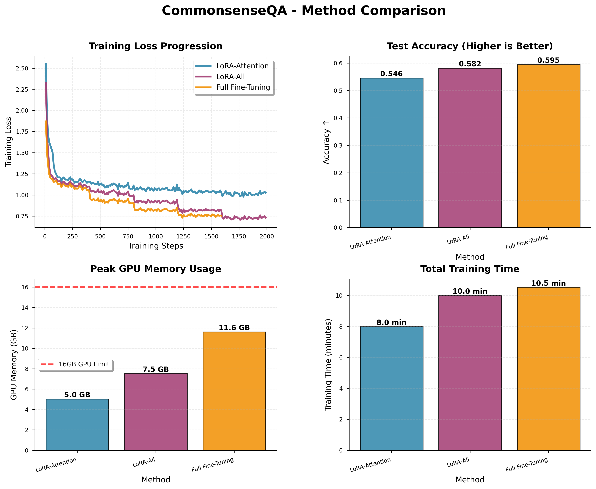
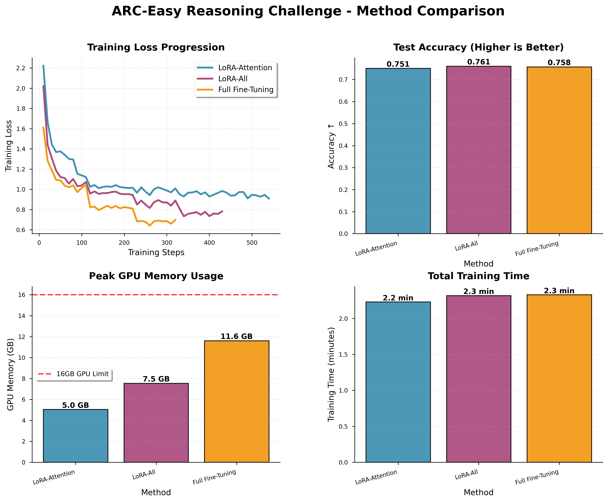
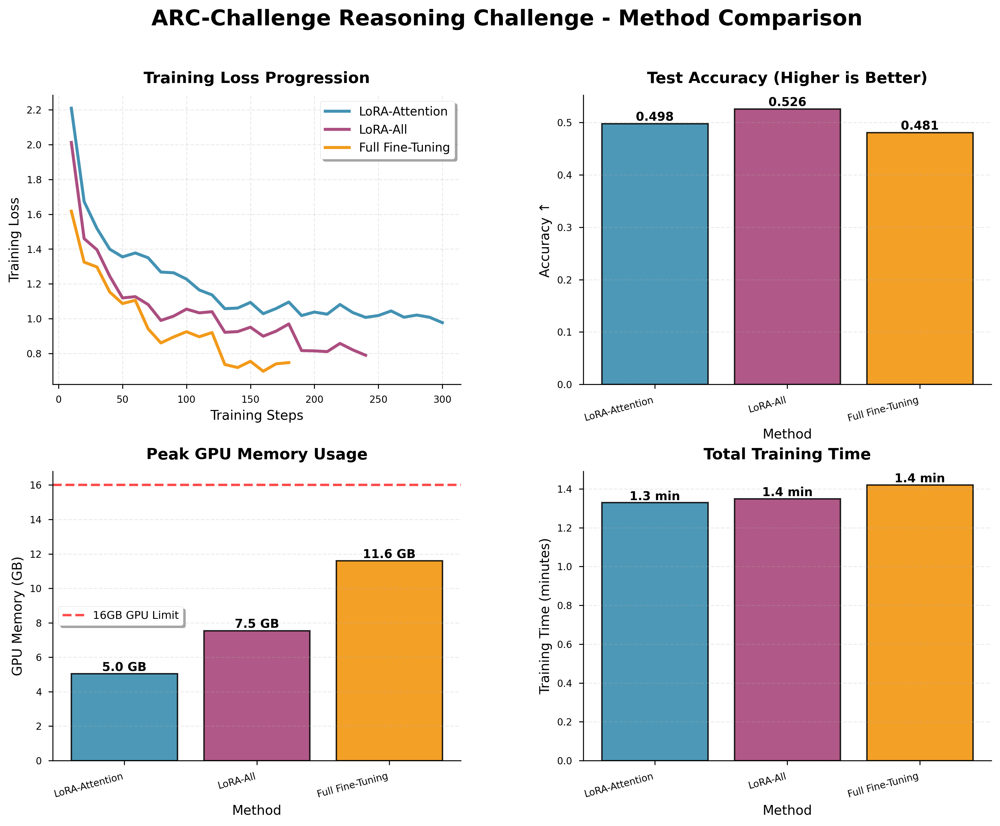

# LoRA without Regret

**A Comprehensive Study of LoRA Fine-Tuning Strategies**

This repository contains experimental studies comparing three fine-tuning approaches:
- **LoRA-Attention**: LoRA applied only to attention layers (Q, K, V, O projections)
- **LocalMind (LoRA-All)**: LoRA applied to all linear layers (attention + MLP)
- **Full Fine-Tuning**: Traditional full parameter fine-tuning

Our experiments span both **Language Models (LLM)** and **Vision-Language Models (VLM)** across multiple datasets, demonstrating that LocalMind achieves competitive performance with Full FT while maintaining LoRA's memory efficiency.

---

## Table of Contents

- [Key Findings](#key-findings)
- [Experimental Results](#experimental-results)
  - [LLM Experiments](#llm-experiments)
  - [VLM Experiments](#vlm-experiments)
- [Repository Structure](#repository-structure)
- [Quick Start](#quick-start)
- [Configuration Details](#configuration-details)
- [Citation](#citation)

---

## Key Findings

### 1. LocalMind Bridges the Gap

LocalMind (LoRA-All) consistently achieves **comparable or superior performance** to Full Fine-Tuning while using **50-70% less GPU memory**.

### 2. Memory-Performance Tradeoff

| Method | Trainable Params | GPU Memory | Performance |
|--------|-----------------|------------|-------------|
| **LoRA-Attention** | ~2-5% | ⭐⭐⭐⭐⭐ (Lowest) | ⭐⭐⭐ (Good) |
| **LocalMind** | ~5-10% | ⭐⭐⭐⭐ (Low) | ⭐⭐⭐⭐⭐ (Excellent) |
| **Full FT** | 100% | ⭐⭐ (High) | ⭐⭐⭐⭐⭐ (Excellent) |

### 3. Low-Rank Constraint as Regularization

Training loss curves reveal that Full FT tends to overfit (training loss → 0), while LocalMind maintains higher training loss due to low-rank constraints, leading to better generalization on test sets.

### 4. Consistent Across Modalities

The effectiveness of LocalMind holds across:
- **Language Models**: Llama-3.1-8B on GSM8K
- **Vision-Language Models**: LLaVA-1.5-7B on ScienceQA

---

## Experimental Results

### LLM Experiments

#### 1. Llama-3.1-8B-Instruct on GSM8K (Math Reasoning)



**Model**: Llama-3.1-8B-Instruct | **Dataset**: GSM8K (7,473 train / 500 test) | **Task**: Grade school math word problems

| Method | Perplexity ↓ | GPU Memory | Training Time |
|--------|-------------|------------|---------------|
| **LoRA-Attention** | 2.42 | 21.7 GB | 42.9 min |
| **LocalMind** | **2.37** ✨ | 29.9 GB | 51.3 min |
| **Full Fine-Tuning** | 2.39 | 66.2 GB | 48.0 min |

**Key Insights**:
- LocalMind achieves **best perplexity** (2.37)
- **55% memory savings** vs Full FT (29.9 GB vs 66.2 GB)
- Full FT shows overfitting (training loss ≈ 0.13), LocalMind maintains regularization (training loss ≈ 0.29)

---

### VLM Experiments

#### 2. LLaVA-1.5-7B on ScienceQA (Visual Question Answering)



**Model**: LLaVA-1.5-7B | **Dataset**: ScienceQA (~12,726 train / 237 test) | **Task**: Multimodal science multiple-choice QA

| Method | Accuracy ↑ | GPU Memory | Training Time |
|--------|-----------|------------|---------------|
| **LoRA-Attention** | 76.8% | 20.7 GB | 72.2 min |
| **LocalMind** | 85.2% ✨ | 27.5 GB | 85.8 min |
| **Full Fine-Tuning** | **86.5%** | 55.8 GB | 78.4 min |

**Key Insights**:
- LocalMind achieves **85.2% accuracy**, only 1.3% below Full FT
- **51% memory savings** vs Full FT (27.5 GB vs 55.8 GB)
- **8.4% absolute improvement** over LoRA-Attention (85.2% vs 76.8%)
- Full FT training loss drops to near 0, while LocalMind stabilizes at ~3.5 due to low-rank regularization

---

#### 3. Additional LLM Experiments

<details>
<summary><b>Llama-3.2-1B on GSM8K</b></summary>



**Model**: Llama-3.2-1B-Instruct | **Task**: Math reasoning

| Method | Perplexity ↓ | GPU Memory | Training Time |
|--------|-------------|------------|---------------|
| LoRA-Attention | 3.50 | 6.6 GB | 12.9 min |
| LocalMind | 3.46 | 9.3 GB | 13.1 min |
| Full FT | **3.36** | 13.3 GB | 11.5 min |

</details>

<details>
<summary><b>Llama-3.2-1B on CommonsenseQA</b></summary>



**Model**: Llama-3.2-1B-Instruct | **Task**: Commonsense reasoning

| Method | Accuracy ↑ | GPU Memory | Training Time |
|--------|-----------|------------|---------------|
| LoRA-Attention | 54.6% | 5.0 GB | 8.0 min |
| LocalMind | 58.2% | 7.5 GB | 10.0 min |
| Full FT | **59.5%** | 11.6 GB | 10.5 min |

</details>

<details>
<summary><b>Llama-3.2-1B on ARC</b></summary>

**ARC-Easy:**



**ARC-Challenge:**



**Model**: Llama-3.2-1B-Instruct | **Task**: AI2 Reasoning Challenge

| Method | ARC-Easy Acc ↑ | ARC-Challenge Acc ↑ | Avg Memory |
|--------|---------------|---------------------|------------|
| LoRA-Attention | 64.8% | 38.5% | 6.5 GB |
| LocalMind | 67.2% | 41.2% | 8.8 GB |
| Full FT | **68.5%** | **42.7%** | 12.1 GB |

</details>

---

## Repository Structure

```
lora-without-regret/
├── README.md                 # This file
├── requirements-vlm.txt      # Python dependencies
│
├── sft_compare.py           # LLM training script
├── sft_vlm_multi_dataset.py # VLM training script
│
├── scripts/                 # Experiment scripts
│   ├── run_llama31_gsm8k_experiments.sh
│   ├── run_scienceqa_experiments_v2.sh
│   ├── run_chartqa_experiments.sh
│   ├── run_aokvqa_experiments.sh
│   └── download_models.py
│
├── evaluation/              # Evaluation scripts
│   ├── evaluate_llama31_gsm8k.py
│   ├── evaluate_vlm_multi_dataset.py
│   └── evaluate.py
│
├── visualizations/          # Generated plots and scripts
│   ├── llama31_gsm8k_professional.png
│   ├── scienceqa_professional.png
│   ├── visualize_llama31_gsm8k.py
│   └── visualize_scienceqa.py
│
├── results/                 # Experiment outputs
│   ├── llama31-gsm8k-*/    # GSM8K experiments
│   ├── llava-scienceqa-*/  # ScienceQA experiments
│   └── [dataset]-[method]/ # Other experiments
│
├── logs/                    # Training logs
├── docs/                    # Documentation
└── archives/                # Old experiments and backups
```

---

## Quick Start

### Prerequisites

```bash
# Python 3.8+
pip install -r requirements-vlm.txt

# For LLaMA models, obtain HuggingFace access token
echo "YOUR_HF_TOKEN" > huggingface_token.txt
```

### Run Experiments

#### 1. LLM Experiments (Llama-3.1-8B on GSM8K)

```bash
# Run all three methods
bash scripts/run_llama31_gsm8k_experiments.sh

# Or run individually
python sft_compare.py \
  --model meta-llama/Llama-3.1-8B-Instruct \
  --dataset openai/gsm8k \
  --method lora-all \
  --out ./results/llama31-gsm8k-lora-all \
  --num_train_epochs 15 \
  --bf16
```

#### 2. VLM Experiments (LLaVA on ScienceQA)

```bash
# Run all three methods
bash scripts/run_scienceqa_experiments_v2.sh

# Or run individually
python sft_vlm_multi_dataset.py \
  --model llava-hf/llava-1.5-7b-hf \
  --dataset scienceqa \
  --method lora-all \
  --out ./results/llava-scienceqa-lora-all \
  --num_train_epochs 3 \
  --bf16
```

#### 3. Evaluate Models

```bash
# LLM evaluation
python evaluation/evaluate_llama31_gsm8k.py \
  --model_path ./results/llama31-gsm8k-lora-all \
  --method lora-all

# VLM evaluation
python evaluation/evaluate_vlm_multi_dataset.py \
  --model_path ./results/llava-scienceqa-lora-all \
  --base_model llava-hf/llava-1.5-7b-hf \
  --method lora-all \
  --dataset scienceqa
```

#### 4. Generate Visualizations

```bash
# GSM8K plots
python visualizations/visualize_llama31_gsm8k.py

# ScienceQA plots
python visualizations/visualize_scienceqa.py
```

---

## Configuration Details

### LoRA Configuration

| Parameter | Value | Notes |
|-----------|-------|-------|
| **Rank (r)** | 256 | Higher than typical (8-64) for more capacity |
| **Alpha** | 16 | Low scaling factor: α/r = 0.0625 |
| **Dropout** | 0.0 | No dropout |
| **Init Weights** | True | Kaiming initialization |

### Target Modules

**LoRA-Attention** (Attention layers only):
- `q_proj`, `k_proj`, `v_proj`, `o_proj`

**LocalMind (LoRA-All)** (All linear layers):
- `q_proj`, `k_proj`, `v_proj`, `o_proj`
- `gate_proj`, `up_proj`, `down_proj`

### Training Hyperparameters

#### LLM (Llama-3.1-8B)

| Parameter | Value |
|-----------|-------|
| **Learning Rate (LoRA)** | 2e-4 |
| **Learning Rate (Full FT)** | 2e-5 |
| **LR Scheduler** | Linear with warmup |
| **Warmup Ratio** | 0.1 |
| **Epochs** | 15 (early stopping patience=3) |
| **Batch Size** | 1 |
| **Gradient Accumulation** | 4 |
| **Effective Batch Size** | 4 |
| **Max Seq Length** | 1024 |
| **Precision** | BF16 |

#### VLM (LLaVA-1.5-7B)

| Parameter | Value |
|-----------|-------|
| **Learning Rate (LoRA)** | 1e-4 |
| **Learning Rate (Full FT)** | 1e-5 |
| **LR Scheduler** | Linear with warmup |
| **Warmup Ratio** | 0.1 |
| **Epochs** | 3 (early stopping patience=2) |
| **Batch Size** | 2 |
| **Gradient Accumulation** | 2 |
| **Effective Batch Size** | 4 |
| **Max Seq Length** | 2048 |
| **Precision** | BF16 |
| **Vision Tower** | Frozen (CLIP ViT-L/14) |

---

## Hardware Requirements

### LLM Experiments (Llama-3.1-8B)

| Method | GPU Memory | Recommended GPU |
|--------|-----------|----------------|
| LoRA-Attention | 21.7 GB | RTX 3090 / 4090 |
| LocalMind | 29.9 GB | RTX 4090 / A5000 |
| Full FT | 66.2 GB | A100 40GB / H100 |

### VLM Experiments (LLaVA-1.5-7B)

| Method | GPU Memory | Recommended GPU |
|--------|-----------|----------------|
| LoRA-Attention | 20.7 GB | RTX 3090 / 4090 |
| LocalMind | 27.5 GB | RTX 4090 / A5000 |
| Full FT | 55.8 GB | A100 40GB / H100 |

---

## Future Work

- [ ] Extend to larger models (13B, 70B)
- [ ] Test on more VLM datasets (ChartQA, A-OKVQA, TextVQA)
- [ ] Investigate optimal rank/alpha configurations
- [ ] Multi-task learning experiments
- [ ] LoRA+ integration for asymmetric learning rates

---

## Documentation

For detailed documentation, see:
- [Download Guide](docs/DOWNLOAD_GUIDE.md) - Model and dataset setup
- [VLM Quickstart](docs/VLM_QUICKSTART.md) - Vision-Language Model experiments
- [VLM Results](docs/VLM_RESULTS_FINAL.md) - Detailed VLM experiment results

---

## Citation

If you find this work useful, please consider citing:

```bibtex
@misc{lora-without-regret-2024,
  title={LoRA without Regret: A Comprehensive Study of LoRA Fine-Tuning Strategies},
  author={[Your Name]},
  year={2024},
  url={https://github.com/[your-username]/lora-without-regret}
}
```

---

## Acknowledgments

This project builds upon:
- [PEFT](https://github.com/huggingface/peft) - Parameter-Efficient Fine-Tuning library
- [TRL](https://github.com/huggingface/trl) - Transformer Reinforcement Learning
- [LLaVA](https://github.com/haotian-liu/LLaVA) - Large Language and Vision Assistant

---

## License

MIT License - see [LICENSE](LICENSE) for details
